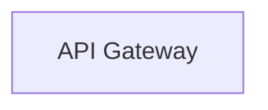

# Functional requirements and Application architecture

## Functional requirements

### Use cases 1 - Market Price Analysis

### Use Case 2 - Filtered Search

### Use Case 3 - Geographical Market Insights

### Use Case 4 - Seller Management & Profiling

### Use Case 5 - Buyer–Seller Communication

### Use Case 6 - Visitor & User Registration

### Use Case 8 - Listing details and comparison*

## Application architecture

