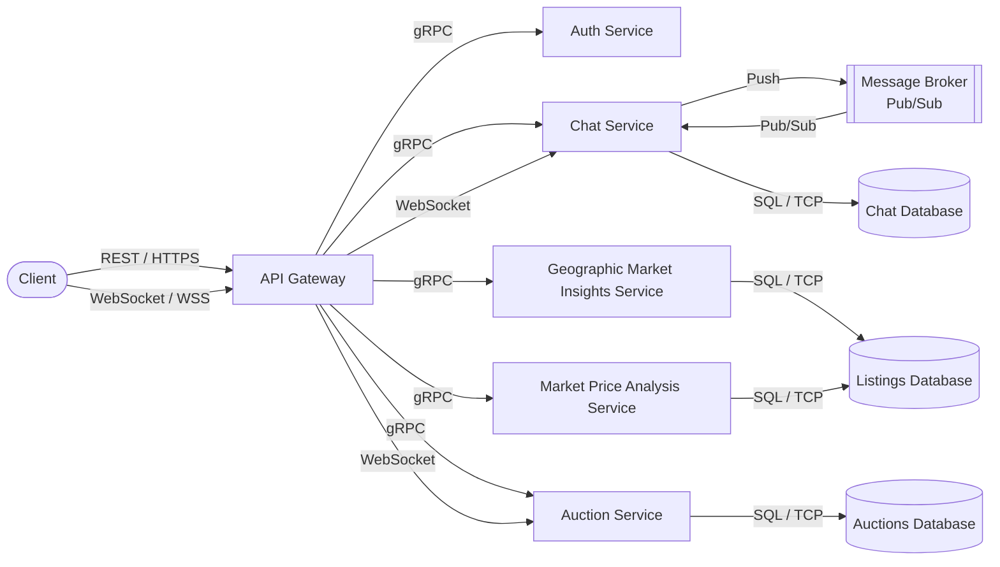

# Functional requirements and Application architecture

## Functional requirements

### Use cases 1 - Market Price Analysis

1. **Statistical Price Analysis**
    The system shall allow any user (authenticated or not) to request market price statistics for a car by specifying at least the brand and model.

2. **Filtering Options**
    The user may optionally filter the price analysis by year range (from/to). If no filters are applied, the system shall return statistics for all listings of that make/model.

3. **Response Format**
    The system shall compute and return this statistics based on matching listings: average price, minimum price, maximum price, total number of listings used in the calculation

4. **Public Accessibility**
    Market price analysis endpoints shall be publicly accessible without requiring user authentication.

5. **Input Validation**
    The system shall validate all input parameters. Invalid or missing mandatory parameters shall result in an HTTP 400 response with a descriptive error message.

### Use Case 2 - Filtered Search

### Use Case 3 - Geographical Market Insights

1. **Price Comparison Across Locations**
    The system shall allow any user (authenticated or not) to query the average listing price of a specific car make and model grouped by country, district, or city. The user must supply at minimum the make and model; grouping granularity (country / district / city) is a required parameter. The response shall include the location label, the average price, and the total number of listings that contributed to that average, sorted by price in ascending or descending order as requested by the user.

2. **Aggregated Market Metrics per Location**
    The system shall expose aggregated market metrics for a given car make and model filtered by one or more specific locations. Supported metrics shall include: average price, median price, and listing count. The user may additionally filter results by year range (from/to) and fuel type. Each location in the response shall include only the metrics the user explicitly requested.

3. **Detailed Price Statistics for a Single Location**
    The system shall allow the user to obtain price statistics for a specific car make/model restricted to a single location. The response shall include the minimum price, maximum price, average price, and median price of matching listings. The user may additionally filter by year range and fuel type. This requirement supports scenarios where a user wants a complete price distribution picture for a specific market (e.g., "What does a 2018 Toyota Corolla cost in Lisbon?").

4. **Public Accessibility**
    All geographical insights endpoints shall be publicly accessible without authentication, so that anonymous visitors can explore market trends before registering.

5. **Input Validation**
    The system shall validate that the brand and model parameters are present for all insights queries. If they are absent or malformed, the system shall return an HTTP 400 response with a human-readable error message. Year range values must be positive integers and year_from must not exceed year_to.

### Use Case 4 - Seller Management & Profiling

### Use Case 5 - Buyer–Seller Communication

1. **Chat Session Initiation**
    An authenticated buyer shall be able to open a chat session with the seller of a specific listing by submitting the listing identifier. If a chat session between that buyer and that seller for that listing already exists, the system shall return the existing session rather than creating a duplicate.

2. **Authentication Requirement**
    Only authenticated users (holding a valid JWT or session cookie) shall be permitted to initiate or participate in a chat session. Unauthenticated requests to any chat endpoint shall receive an HTTP 401 response.

3. **Real-Time Messaging via WebSocket**
    Once a chat session is open, both the buyer and the seller shall be able to send and receive text messages in real time through a persistent WebSocket connection (/ws/chat/{chat_id}). The WebSocket upgrade shall require a valid authentication token. Messages shall be delivered to the other party immediately if they are connected; if the recipient is offline, the message shall be persisted and delivered when they reconnect.

4. **Message Persistence and Chat History**
    All messages sent within a chat session shall be persisted in a dedicated store. An authenticated participant of a session shall be able to retrieve the full message history for that session via a REST endpoint (GET /api/chat/{chat_id}). The history response shall include each message's content, sender identifier, and timestamp.

5. **Access Control**
    A user may only read or write in chat sessions in which they are a participant (either as the buyer or the seller of the associated listing). Any attempt to access a chat session by a user who is not a participant shall result in an HTTP 403 response.

6. **Chat Session Identification**
    Each chat session shall be uniquely identified by a chat_id returned at session creation. This identifier shall be used in all subsequent REST and WebSocket interactions related to that session.

7. **Connection Lifecycle**
    The system shall handle WebSocket disconnections gracefully. If a client disconnects unexpectedly, the session shall remain open server-side and the client shall be able to reconnect and resume the conversation without data loss.

### Use Case 6 - Visitor & User Registration
1. **User Registration**
    The system shall allow a visitor to create an account by providing, at minimum, an email and password. Email addresses must be unique and attempts to register an existing email shall return an HTTP 409 response. Invalid input shall return an HTTP 400 response.

2. **User Login**
    The system shall allow a registered user to authenticate via email and password. On success, the system shall issue a JWT or session cookie. Invalid credentials shall return an HTTP 401 response, and invalid input shall return an HTTP 400 response.

3. **Save Listing to Favorites**
    An authenticated user shall be able to save a listing to their favorites by providing the listing identifier. If the listing does not exist, the system shall return an HTTP 404 response; if the listing is already in favorites, it shall return an HTTP 409 response. Unauthenticated requests shall return an HTTP 401 response.

4. **Remove Listing from Favorites**
    An authenticated user shall be able to remove a listing from their favorites. If the listing is not found, the system shall return an HTTP 404 response. Unauthenticated requests shall return an HTTP 401 response.

5. **Favorites Retrieval**
    An authenticated user shall be able to retrieve their saved listings. The response shall include a list of saved listing identifiers. Unauthenticated requests shall return an HTTP 401 response.

### Use Case 7 - Auction Module

1. **Auction Creation**
    The system shall allow authenticated sellers to create an auction for an existing car listing.

2. **Auction Configuration**
    When creating an auction, the seller must specify the starting price, the optional reserve price, and auction duration (start and end time). 

3. **Auction Display**
    The system shall allow users to retrieve a list of auctions, filterable by: auction status (active, ended), car brand and model, and location.

4. **Bid Placement**
    The system shall allow authenticated users to place bids on active auctions.

5. **Bid Validation**
    The system shall validate that each bid is higher than the current highest bid before accepting it.

6. **Auction Conclusion**
    The system shall automatically determine the outcome of an auction when the configured end time is reached.

7. **Real-Time Auction Updates**
    The system shall notify connected clients in real time when a new bid is placed on an active auction and when an auction ends. These notifications shall be delivered using WebSocket connections.

### Use Case 8 - Listing details and comparison*

## Application architecture

