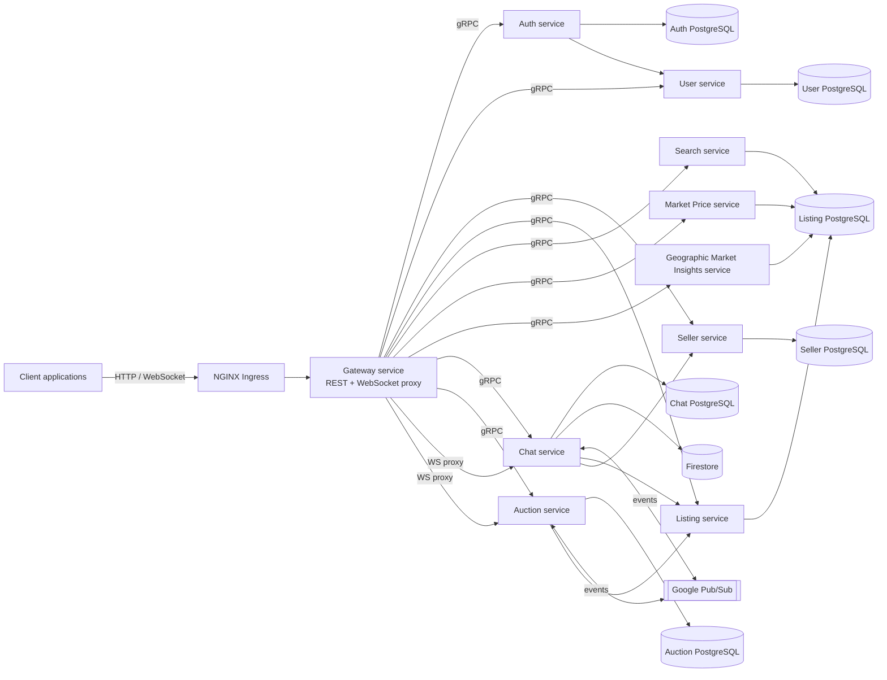

# Functional requirements and application architecture

## Functional requirements

### Use case 1 - Market Price Analysis

1. The system shall expose a public endpoint to retrieve average market price information for a vehicle based on `brand` and `model`.
2. The request may optionally include `year_from` and `year_to` filters.
3. The response shall be computed from marketplace listings stored in the listing data store.
4. Invalid HTTP methods shall return `405 Method Not Allowed`.
5. Service or repository failures shall be surfaced by the gateway as server-side errors.

### Use case 2 - Filtered Search

1. The system shall expose a public search endpoint for car listings.
2. The implemented search filters shall include `make`, `model`, `year`, `minPrice`, `maxPrice`, `maxMileage`, `fuelType`, `page`, `pageSize`, and `includeSold`.
3. Search results shall be paginated.
4. The system shall also expose a public endpoint that returns general listing pages without requiring detailed filters.
5. The search capability shall use the search microservice backed by listing data stored in PostgreSQL.

### Use case 3 - Geographical Market Insights

1. The system shall expose a public endpoint to compare prices by `district`, `city`, or `country` for a given `brand` and `model`.
2. The price-comparison endpoint shall support optional `sort_by`, `order`, `limit`, and `skip` parameters.
3. The system shall expose a public aggregates endpoint that supports configurable metrics, location grouping, optional location filters, year range filters, fuel type filters, and pagination controls.
4. The system shall expose a public endpoint for location-specific statistics that returns price information for a selected market.
5. Geographical insights shall be served by a dedicated microservice connected to the listing database.

### Use case 4 - Seller Management and Profiling

1. The system shall expose a public endpoint to retrieve seller profile information by seller identifier.
2. Seller information shall be served by a dedicated seller service.
3. The platform may expose preview endpoints to support seller summary retrieval in upstream experiences.

### Use case 5 - Buyer-Seller Communication

1. Only authenticated users shall be allowed to open chat sessions, list their chats, retrieve chat history, or connect to the chat WebSocket endpoint.
2. A chat session shall be associated with a marketplace listing and the corresponding buyer and seller.
3. The system shall expose a REST operation to open a chat or reuse an existing one.
4. The system shall expose a WebSocket endpoint that proxies authenticated traffic from the gateway to the chat service.
5. Chat history shall be persisted and retrievable through the chat history endpoint.
6. The chat service shall support horizontal scaling by propagating real-time events through Google Pub/Sub.
7. The implementation shall support cloud message persistence through Firestore in addition to chat indexing data.

### Use case 6 - Visitor and User Registration

1. The system shall allow visitors to register with `name`, `email`, and `password`.
2. The system shall allow registered users to log in and obtain an authentication token.
3. Authenticated users shall be able to retrieve their list of favorite listings.
4. Authenticated users shall be able to add a listing to favorites.
5. Authenticated users shall be able to remove a listing from favorites.
6. Authentication shall be enforced at gateway level through JWT validation before protected routes are forwarded to downstream services.

### Use case 7 - Auction Module

1. The system shall expose a public endpoint to list auctions with pagination and optional status filtering.
2. The system shall expose a public endpoint to retrieve auction details and a public endpoint to retrieve auction bids.
3. Only authenticated users shall be allowed to create auctions, delete their auctions, place bids, or connect to the auction WebSocket endpoint.
4. Auction creation and bidding shall be handled by a dedicated auction service.
5. The system shall expose a WebSocket endpoint for live auction updates through the gateway.
6. The auction service shall support horizontal scaling by propagating auction events through Google Pub/Sub.

### Use case 8 - Listing details and comparison

1. The system shall expose a public endpoint to retrieve detailed information for an individual listing.
2. The system shall expose a public endpoint to compare multiple listings using a list of listing identifiers.
3. Authenticated users shall be able to create, update, and delete listings through the gateway.
4. Listing and comparison operations shall be served by the listing service, while search-oriented retrieval shall be served by the search service.

### Cross-cutting platform requirements

1. The platform shall expose a REST gateway as the single public HTTP entry point for local and Kubernetes deployments.
2. The gateway shall translate HTTP requests into gRPC calls to the internal services.
3. The platform shall expose a health endpoint for readiness and liveness checks.
4. Local execution shall be supported through Docker Compose.
5. Cloud execution shall be supported through Kubernetes manifests, namespace-scoped configuration, services, deployments, and horizontal pod autoscalers.

## Application architecture

The current project is organized as a Go microservices platform with a REST and WebSocket gateway in front of internal gRPC services. Locally, the stack runs with Docker Compose. In the cloud, the same services are deployed to Kubernetes under the `vehicles-prod` namespace, fronted by an NGINX ingress and configured for autoscaling.

### Main runtime components

- **Gateway service**: Single HTTP entry point. Exposes REST routes under `/api`, validates JWTs for protected endpoints, and proxies chat and auction WebSocket traffic.
- **Listing service**: Handles listing detail retrieval, comparison, and authenticated listing lifecycle operations.
- **Search service**: Handles paginated listing search based on marketplace filters.
- **Market Price service**: Computes average market price for a brand and model.
- **Geographic Market Insights service**: Produces price comparisons, aggregate metrics, and by-location statistics.
- **Auth service**: Registers users and issues authentication tokens.
- **User service**: Manages user profiles and favorite listings.
- **Seller service**: Serves seller profile data and seller previews.
- **Chat service**: Manages buyer-seller chat creation, chat history, and live messaging.
- **Auction service**: Manages auction creation, deletion, bidding, bid retrieval, and live updates.

### Data and messaging

- **Listing PostgreSQL database**: Shared source of truth for listing, search, market price, and geographic insights operations.
- **Auth PostgreSQL database**: Stores authentication data.
- **User PostgreSQL database**: Stores user profiles and favorites.
- **Seller PostgreSQL database**: Stores seller-facing data.
- **Chat PostgreSQL database**: Stores chat participant and chat index data.
- **Auction PostgreSQL database**: Stores auctions and bids.
- **Firestore**: Used by the chat service for message persistence in cloud-oriented flows.
- **Google Pub/Sub**: Used by chat and auction services so real-time events can be broadcast consistently across multiple replicas.

### Deployment model

- **Local environment**: `scripts/local/prepare.sh`, `scripts/local/start.sh`, and `scripts/local/seed.sh` prepare the dataset, start containers, and load seed data.
- **Cloud environment**: `scripts/cloud/bootstrap_env.sh` prepares Google Cloud tooling and Cloud SQL Proxy support, while `scripts/cloud/k8s.sh` applies, removes, checks, or restarts the Kubernetes deployment.
- **Ingress**: The Kubernetes ingress routes `/api/`, `/api/chat/ws/`, and `/api/auctions/ws/` traffic to the gateway service.
- **Autoscaling**: Dedicated HPA manifests exist for scalable services such as listing, search, chat, auth, user, seller, marketprice, auction, and geographic market insights.

